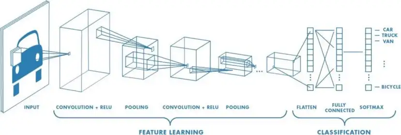
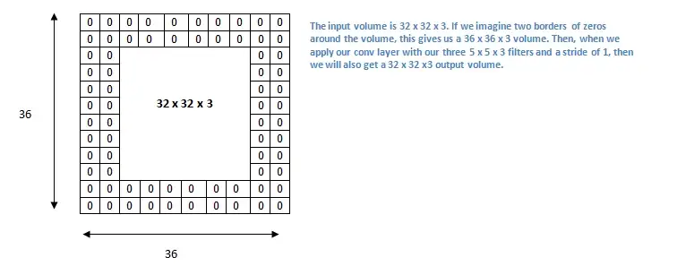
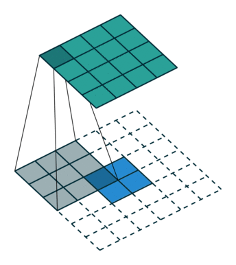

# Convolutional Neural Network 

## Introduction 
A convolutional neural network has two parts namely the feature learning and classification part. In the feature learning part, we have many convolutional blocks and generally each such conv block consists of three operation namely, convolution, activation and pooling. A CNN model can have many convolutional blocks and fully connected layers depends on the network design. With each convolutional layer we need to specify the number of filters . Filters detect patterns include — edges , shapes, textures, curves, objects , colors etc. The classification part has the feed forward neural network. CNN learns the kernel parameters while training. So we don’t need to manually design kernels for specific feature extraction.

## The Convolution Operation and the kernels
In image processing domain, people use manually defined kernels or filters for image denoising, transformations etc. But in the context of CNNs, kernels are trainable during the training. Initially we take random weights for each parameter in a filter (kernel) and using backpropagation we get the optimized parameter values for each parameter. What we are doing in convolution? It is just a series of dot products between kernel values and different regions of the image. To capture all parts of the input image we slide the kernel window over the images. The filter associated with the convolutional layer slides over each 3*3 set of pixels from the input. The process is repeated until the filter covers all 3*3 block of pixels. This sliding is referred to as convolving. The results of the dot product is stored in the output, known as feature map. Now consider the following figure which shows how convolutions are happening using kernels.

We can have many different kernels for feature extraction ( vertical edges, curves, boundaries etc. ). In the feature map, high dot product represents good matching portion of the input image with respect to the kernel operator. So what to do with the feature map?

## Pooling Operation 
The feature map we get after the convolution operation is sensitive to the location of the features in the input image. To address this sensitivity we down sample the feature maps using pooling. So the resultant down sampled feature will be more robust to changes in the position of the feature in the input image ( local translation invariance). Since the input has huge dimension, we need to perform many multiplication operations. But fortunately through pooling we need less amount of computation while training. There are various kinds of pooling, max pool and average pooling are the common choices here. In pooling we take a small region in the feature map and take the maximum value if it is max pooling , if we are applying average pooling we take the average of values in the selected region. Lets consider the following figure to understand how we can do max pooling on the feature map.

## Padding Operation 
Padding is the process of adding extra set pixels of zero to the input images to avoid information loss during the convolution operation. Padding helps to improves the performance by keeping the information at the borders. If we don’t use padding then the volume size reduces so quickly and the information would washed away too quickly.

There are three kinds of padding in deep learning namely, valid padding, same padding and full padding. Valid padding means no padding at all. Same padding will keep the image size after the convolution. Full padding ensures that all pixels have same influence on output. In this case output is larger than the input.

## Striding Operation 
In strided convolution we shift the window by more than one pixel range. If the stride is 2 then the kernel will slide over the image with the shift of 2 pixels(row or column).

## Fully Connected Layer 
After each convolution layers, our input data gets huge number of dimensions . We flatten the parameters after all the convolution and then we design the feed forward network. We can have many number of fully connected layers. In the final layers we use SoftMax activation function if we address a multiclass classification problem, and sigmoid if we have a binary classification problem. In the following section lets create a Convolutional neural network using keras.

