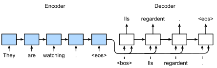
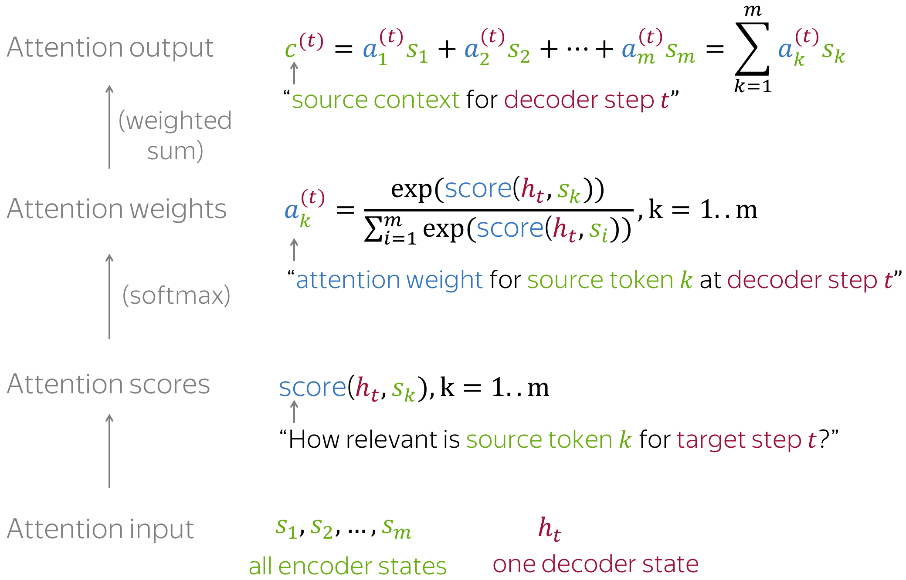

# Encoder Decoder/with and without attention Architecture

- Encoder encodes the sequence into a context vector(a new representation)
- Decoder takes the context vector into output sequence
- Encode all - decode one at a time; encoder reads all the input sequence and create a context vector. Decoder use this context vector and previously decoded result to create new output step by step
- Teacher forcing : During training decoder receives the correct output from the training set as the previously decoded result to predict the next output. However,during inference decoder receives the previously decoded result to predict the next output. Teacher forcing improves training process.
- we can increase the context vector dimension in two ways ;
    - increase the number of hidden units in lstm cell
    - increase the lstm no of layers
- Decoder will work in such a **loop** using its states and output as the next step context vector and input **until**:
    - the generated output is a special symbol (e.g. '***STOP***' or '***END***') or
    - the ***pre-defined maximum steps*** (length of output) is reached.
- ***decoder_inputs*** we will provide '***START’*** token as the ***initial input***
- Encoder receives `encoder input data` and converts it to a context vector.
- Decoder runs in a loop:
    - Decoder is initialized with context vector and recives `decoder input data`
    - Decoder converts `decoder input data` to one time step output
    - Decoder also outputs its hidden states and cell states as context vector
    - in the next cycle of the loop, decoder use its states and output as the input for itself (the context vector and the input)

## Adding attention mechanism 
- To improve the enocder-decoder model, attention mechasnism is added. 
- attention mechanism allows us to create dynamic context vectors rather than using a fixed context vector. 
- Dyanimc context vector is created by taking a weighted aggregation of all the encoder states. 
- weights are calculated using another neural network. 
Following digram shows how we compute the dynamic context vector; 

### Resouces Used 
* https://lena-voita.github.io/nlp_course/seq2seq_and_attention.html
 
