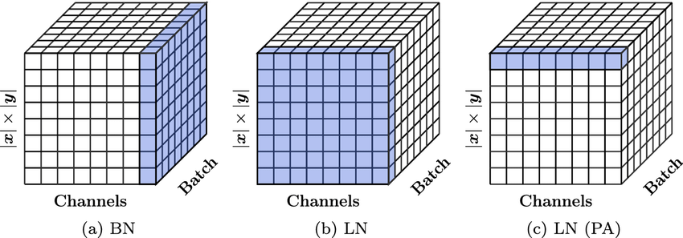

# Batch Normalization

In batch normalization, we find the mean and standard deviation of all features across batch. 

In layer normalization, we find the aggregations per each inputs across all features(not across all batches) 

Following is the calculation of batch normalization; 

$$
\begin{align}
\mu_b = \frac{1}{B}\sum_{i=1}^{B}x_i \text{}\text{ } (1)\\ \sigma_b^2 = \frac{1}{B}\sum_{i=1}^{B}(x_i - \mu_b)^2 \text{}\text{ } (2)\\ \hat{x_i} = \frac{x_i - \mu_b}{\sqrt{\sigma_b^2}} \text{}\text{} (3)\\ or\text{ }\hat{x_i} = \frac{x_i - \mu_b}{\sqrt{\sigma_b^2 + \epsilon}} \text{}\text{ } (3) \\ Adding\text{ }\epsilon\text{ }helps\text{ }when\text{ }\sigma_b^2\text{ }is\text{ }small\\ y_i = \mathcal{BN}(x_i) = \gamma.x_i + \beta \text{}\text{ }(4)
\end{align}
$$

Following is the calculation of layer normalization; 

$$
\begin{align}
\mu_l = \frac{1}{d}\sum_{i=1}^{d}x_i \text{}\text{ } (1)\\ \sigma_l^2 = \frac{1}{d}\sum_{i=1}^{d}(x_i - \mu_l)^2 \text{}\text{ } (2)\\ \hat{x_i} = \frac{x_i - \mu_l}{\sqrt{\sigma_l^2}} \text{}\text{ } (3)\\ or\text{ }\hat{x_i} = \frac{x_i - \mu_l}{\sqrt{\sigma_l^2 + \epsilon}} \text{}\text{ } (3) \\ Adding\text{ }\epsilon\text{ }helps\text{ }when\text{ }\sigma_l^2\text{ }is\text{ }small\\ y_i = \mathcal{LN}(x_i) = \gamma.x_i + \beta \text{}\text{ }(4)
\end{align}
$$

- Batch normalization normalizes each feature independently across the mini-batch. Layer normalization normalizes each of the inputs in the batch independently  across all features.
- As batch normalization is dependent on batch size, it’s not effective for small batch sizes. Lyaer normalization is independent of the batch size, so it can be applied to batches with smaller sizes as well.
- During training, batch normalization computes the mean and standard deviation coresponding to the mini-batch. However, at test time(inference time), we may not necessarily have a batch to compute the batch mean and variance. To overcome this limitation, the model workds by maintaining a moving average of mean and variance at training time, called the moving mean and moving variance. These values are accumulated across batches at training time and used as mean and variance at inference time.
